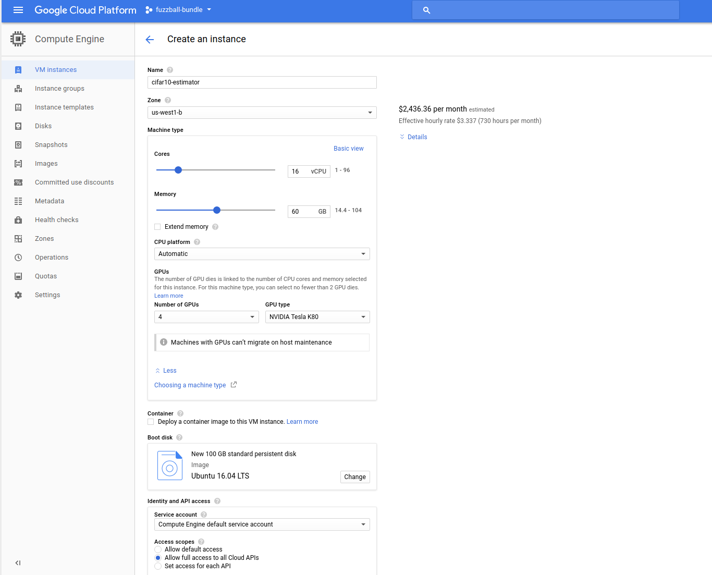
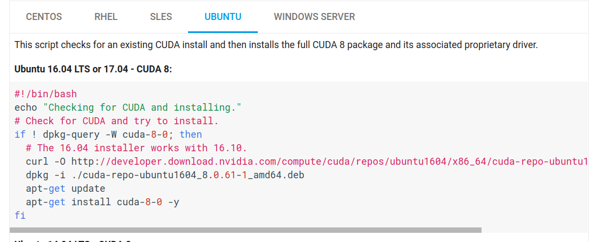
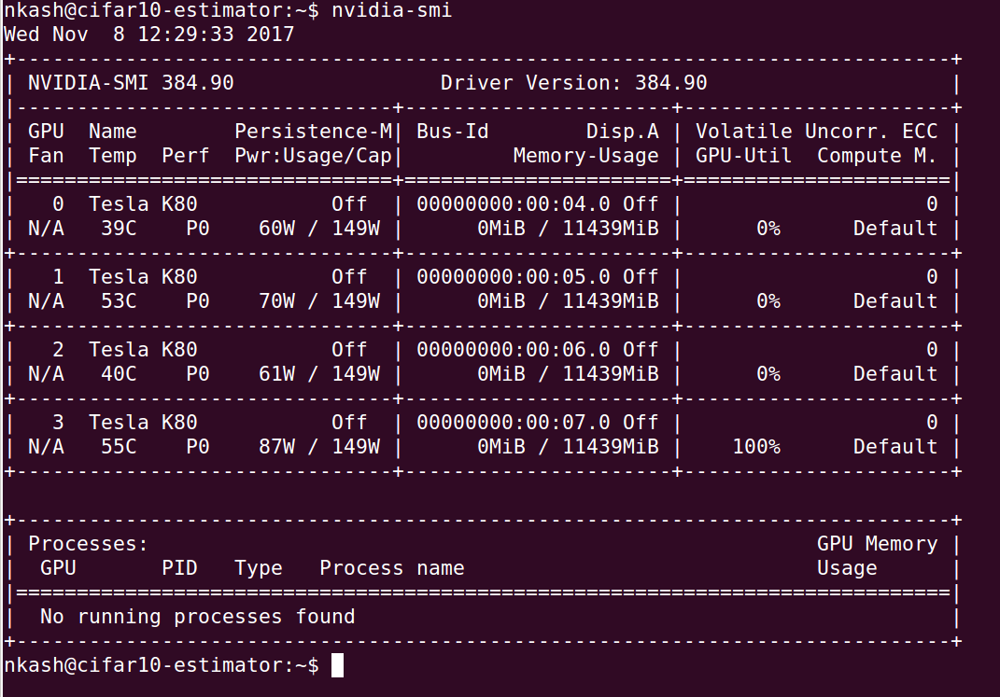

# The GCE survival guide: TensorFlow Estimator

The nice thing about the [TensorFlow Estimator API](https://www.tensorflow.org/programmers_guide/estimators) is that it provides the same checkpointing semantics as the ones we are using as part of our survival process.

Moreover, the [Cloud ML Engine trainer interface](https://cloud.google.com/ml-engine/docs/packaging-trainer) also accepts model parameters and hyperparameters in the same fashion suggested here. So we should easily be able to take a model intended to run on Cloud ML Engine and run it on a single (but beefy) GCE instance.

Exactly such a model exists! We will make use of the tensorflow/models [CIFAR-10 estimator example](https://github.com/tensorflow/models/tree/master/tutorials/image/cifar10_estimator).

Let us follow each of the steps as outlined in [the main README](./README.md).


## Custom image

The CIFAR-10 example in question is designed to use multiple GPUs. We will need a GCE instance capable of supporting this. **Let us start out by creating such a GCE instance once and freezing it into a custom image.**

(Note: If you are following along but don't feel like covering the cost of a multi-GPU GCE instance, you can also use one without any GPUs. If you decide to skip the GPUs, ignore all the CUDA and cuDNN instructions below.)

### Instance creation

Before we can create a GPU instance, we must make sure that we have enough GPUs available to us in our project's quota and in our desired region. You can check this on [IAM and admin quota page](https://console.cloud.google.com/iam-admin/quotas). If you do not have enough GPUs in your quota, you will have to request them in the appropriate zone. [This page has a list of zones in which GPUs are available](https://cloud.google.com/compute/docs/gpus/). For the purposes of this guide, I will use four NVIDIA K80 GPUs in `us-west1-b`.

It is simplest to [create the GCE instance through the Cloud Console](https://console.cloud.google.com/compute/instancesAdd):



Those are the settings I used, which amount to a cost of about $3.34 per hour (in USD).

### Environment setup

(Note: Unless otherwise specified, the shell commands in this section should be run on the VM instance that we just created.)

Once you click the "Create Instance" button at the bottom of that screen, you have to give it a couple of minutes for the VM to start up. You can monitor the state of your creation request on [the "VM instances" screen on the Cloud Console](https://console.cloud.google.com/compute/instances) or using the `gcloud` CLI from a terminal

```bash
gcloud compute instances list
```

which will show you all of your running instances along with their corresponding statuses. Once the instance is up and ready, you will see a green circle with a check mark in it on the Cloud Console or a status of `RUNNING` in your terminal. At that point, you can SSH into the instance to setup your environment, either by selecting the "SSH" option from the three vertical ellipsis beside your instance info in the Cloud Console or, more simply, using the `gcloud` CLI:

```bash
gcloud compute ssh cifar10-estimator --zone=us-west1-b
```

(Note: In the latter case, if this is your first time SSHing into a GCE instance, you will be prompted to generate an SSH key for this purpose.)

Now, we need to make our GPUs available to TensorFlow by installing CUDA drivers and the cuDNN library. We will follow the instructions [here](https://www.tensorflow.org/install/install_linux).


#### CUDA drivers

To install the CUDA drivers, we can [follow the instructions here](https://cloud.google.com/compute/docs/gpus/add-gpus#install-gpu-driver).

Inside the instance, create a script in your home directory -- `cuda.sh` -- containing the appropriate installation script from the GPU docs page:



Once that is done, simply run the following command inside your instance

```bash
sudo ./cuda.sh
```

Once the script has run, you can verify that the CUDA drivers were correctly installed using the following command:

```bash
nvidia-smi
```

You should see something like this:




Finally, as per the TensorFlow instructions, we need to add the CUDA path to our `LD_LIBRARY_PATH` environment variable, which we will do in our `.bashrc` file on the VM. Add the following lines to the end of your `.bashrc`:

```
export CUDA_HOME=/usr/local/cuda-8.0
export LD_LIBRARY_PATH=$LD_LIBRARY_PATH:$CUDA_HOME/lib64
```

With that done, run

```bash
source .bashrc
```

And to verify that the change took effect:

```bash
echo $CUDA_HOME $LD_LIBRARY_PATH
```


#### cuDNN library

Note that [tensorflow requires us to use cuDNN v6](https://www.tensorflow.org/install/install_linux). [You can download this library from nvidia](https://developer.nvidia.com/rdp/cudnn-download), which will require to register as a a developer with them. The registration is free.

Download `cuDNN v6.0 Library for Linux`. This should put a `.tgz` archive on your machine. But we want that file to live on the GCE instance. Luckily, it is easy to make this transfer. Assuming that the file got downloaded to your `!/Downloads` directory, run the following command **from your own machine and not from the VM**:

```bash
gcloud compute scp ~/Downloads/cudnn-8.0-linux-x64-v6.0.tgz cifar10-estimator:~/
```

That will put the file in your home directory on the VM instance. Now unpack the archive:

```bash
tar xvfz cudnn-8.0-linux-x64-v6.0.tgz
```

Now you have to copy over the artifacts into the appropriate subdirectories of your CUDA directory:

```bash
sudo cp cuda/include/cudnn.h /usr/local/cuda-8.0/include
```

```bash
sudo cp cuda/lib64/* $CUDA_HOME/lib64
```

Finally, [as per nvidia's instructions](https://www.nvidia.com/en-us/data-center/gpu-accelerated-applications/tensorflow/):

```bash
sudo chmod a+r /usr/local/cuda-8.0/include/cudnn.h $CUDA_HOME/lib64/libcudnn*
```


#### libcupti-dev

Finally, we need to install `libcupti-dev`, as per the tensorflow instructions. We can do so from `apt`:

```bash
sudo apt-get install libcupti-dev
```


#### Python environment

Note that our Ubuntu 16.04 image comes with Python 2.7.12 installed, which is sufficient to our purposes. If you wanted, though, you could also install whichever flavor of Python best suited you at this time.

We will have to install `pip`, though:

```bash
sudo apt-get install python-pip
```

And now let us install `tensorflow-gpu`:

```bash
pip install tensorflow-gpu
```

You can check that tensorflow has access to your GPUs by starting up your Python interpreter and creating a TensorFlow session:

```python
>>> import tensorflow as tf
>>> tf.Session()
```

If this errors out, there is a problem (please raise an issue in this repo).


#### Cleaning up your home directory

Now that we've got everything set up, let us clear up our home directory a bit:

```bash
sudo rm -r cuda/
mkdir image-setup
mv cud* image-setup/
```


#### Creating the image

And now, we can create the image. It is possible to create an image from a running instance, but it is much safer to do so from a stopped instance, so let us take the safe route. Stop the `cifar10-estimator` instance either in the Cloud Console or using `gcloud` as follows:

```bash
gcloud compute instances stop cifar10-estimator
```

You can easily create the image in the Cloud Console from the disk attached to the VM we just stopped by clicking on the "Create Image" button at the top of the [Images page](https://console.cloud.google.com/compute/images) and creating an image from the disk attached to the VM instance in question (which should have the same name). Here, let me show you how to create an image from the command line:

```bash
gcloud compute images create gpu-tensorflow --source-disk cifar10-estimator --source-disk-zone us-west1-b
```

- - -

[HOME](./README.md)
