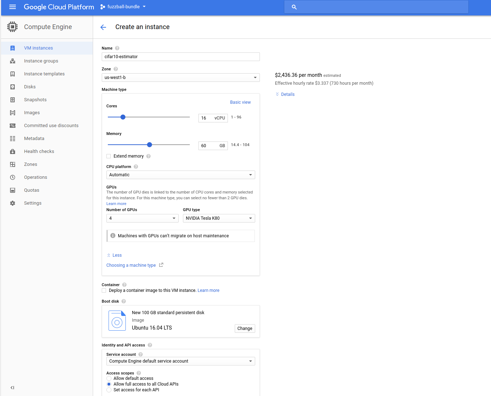
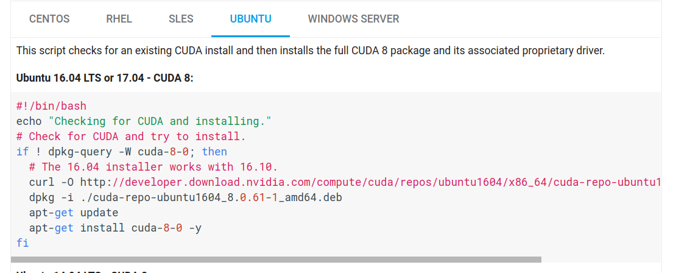
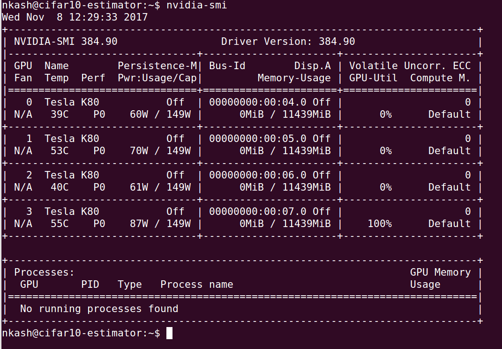

# Compute Engine survival training: TensorFlow Estimator

The nice thing about the [TensorFlow Estimator API](https://www.tensorflow.org/programmers_guide/estimators) is that it provides the same checkpointing semantics as the ones we are using as part of our survival process.

Moreover, the [Cloud ML Engine trainer interface](https://cloud.google.com/ml-engine/docs/packaging-trainer) also accepts model parameters and hyperparameters in the same fashion suggested here. So we should easily be able to take a model intended to run on Cloud ML Engine and run it on a single (but beefy) Compute Engine instance.

Exactly such a model exists! We will make use of the tensorflow/models [CIFAR-10 estimator example](https://github.com/tensorflow/models/tree/master/tutorials/image/cifar10_estimator). The estimator in question wraps a neural network designed to address the image classification task posed by the [CIFAR-10 dataset](https://www.cs.toronto.edu/~kriz/cifar.html) (which consists of 60,000 images distributed uniformly over 10 classes).

Let us follow each of the steps as outlined in [the main README](./README.md) to set this particular model to train on a GPU-enabled Compute Engine instance.


## Custom image

The CIFAR-10 example in question is designed to use multiple GPUs. We will need a Compute Engine instance capable of supporting this. **Let us start out by creating such a Compute Engine instance once and freezing it into a custom image.**

(Note: If you are following along but don't feel like covering the cost of a multi-GPU Compute Engine instance, you can also use one without any GPUs. If you decide to skip the GPUs, ignore all the CUDA and cuDNN instructions below.)

### Instance creation

Before we can create a GPU instance, we must make sure that we have enough GPUs available to us in our project's quota and in our desired region. You can check this on [IAM and admin quota page](https://console.cloud.google.com/iam-admin/quotas). If you do not have enough GPUs in your quota, you will have to request them in the appropriate zone. [This page has a list of zones in which GPUs are available](https://cloud.google.com/compute/docs/gpus/). For the purposes of this guide, I will use four NVIDIA K80 GPUs in `us-west1-b`.

It is simplest to [create the Compute Engine instance through the Cloud Console](https://console.cloud.google.com/compute/instancesAdd):



Those are the settings I used, which amount to a cost of about $3.34 per hour (in USD).

### Environment setup

(Note: Unless otherwise specified, the shell commands in this section should be run on the VM instance that we just created.)

Once you click the "Create Instance" button at the bottom of that screen, you have to give it a couple of minutes for the VM to start up. You can monitor the state of your creation request on [the "VM instances" screen on the Cloud Console](https://console.cloud.google.com/compute/instances) or using the `gcloud` CLI from a terminal

```bash
gcloud compute instances list
```

which will show you all of your running instances along with their corresponding statuses. Once the instance is up and ready, you will see a green circle with a check mark in it on the Cloud Console or a status of `RUNNING` in your terminal. At that point, you can SSH into the instance to setup your environment, either by selecting the "SSH" option from the three vertical ellipsis beside your instance info in the Cloud Console or, more simply, using the `gcloud` CLI:

```bash
gcloud compute ssh cifar10-estimator --zone=us-west1-b
```

(Note: In the latter case, if this is your first time SSHing into a Compute Engine instance, you will be prompted to generate an SSH key for this purpose.)

Now, we need to make our GPUs available to TensorFlow by installing CUDA drivers and the cuDNN library. We will follow the instructions [here](https://www.tensorflow.org/install/install_linux).


#### CUDA drivers

To install the CUDA drivers, we can [follow the instructions here](https://cloud.google.com/compute/docs/gpus/add-gpus#install-gpu-driver).

Inside the instance, create a script in your home directory -- `cuda.sh` -- containing the appropriate installation script from the GPU docs page:



Once that is done, simply run the following command inside your instance

```bash
sudo ./cuda.sh
```

Once the script has run, you can verify that the CUDA drivers were correctly installed using the following command:

```bash
nvidia-smi
```

You should see something like this:




Finally, as per the TensorFlow instructions, we need to add the CUDA path to our `LD_LIBRARY_PATH` environment variable, which we will do in our `.bashrc` file on the VM. Add the following lines to the end of your `.bashrc`:

```
export CUDA_HOME=/usr/local/cuda-8.0
export LD_LIBRARY_PATH=$LD_LIBRARY_PATH:$CUDA_HOME/lib64
```

With that done, run

```bash
source .bashrc
```

And to verify that the change took effect:

```bash
echo $CUDA_HOME $LD_LIBRARY_PATH
```


#### cuDNN library

Note that [tensorflow requires us to use cuDNN v6](https://www.tensorflow.org/install/install_linux). [You can download this library from nvidia](https://developer.nvidia.com/rdp/cudnn-download), which will require to register as a developer with them. The registration is free.

Download `cuDNN v6.0 Library for Linux`. This should put a `.tgz` archive on your machine. But we want that file to live on the Compute Engine instance. Luckily, it is easy to make this transfer. Assuming that the file got downloaded to your `!/Downloads` directory, run the following command **from your own machine and not from the VM**:

```bash
gcloud compute scp ~/Downloads/cudnn-8.0-linux-x64-v6.0.tgz cifar10-estimator:~/
```

That will put the file in your home directory on the VM instance. Now unpack the archive:

```bash
tar xvfz cudnn-8.0-linux-x64-v6.0.tgz
```

Now you have to copy over the artifacts into the appropriate subdirectories of your CUDA directory:

```bash
sudo cp cuda/include/cudnn.h /usr/local/cuda-8.0/include
```

```bash
sudo cp cuda/lib64/* $CUDA_HOME/lib64
```

Finally, [as per nvidia's instructions](https://www.nvidia.com/en-us/data-center/gpu-accelerated-applications/tensorflow/):

```bash
sudo chmod a+r /usr/local/cuda-8.0/include/cudnn.h $CUDA_HOME/lib64/libcudnn*
```


#### libcupti-dev

Finally, we need to install `libcupti-dev`, as per the tensorflow instructions. We can do so from `apt`:

```bash
sudo apt-get install libcupti-dev
```


#### Python environment

Note that our Ubuntu 16.04 image comes with Python 2.7.12 installed, which is sufficient to our purposes. If you wanted, though, you could also install whichever flavor of Python best suited you at this time.

We will have to install `pip`, though:

```bash
sudo apt-get install python-pip
```

And now let us install `tensorflow-gpu`:

```bash
pip install tensorflow-gpu
```

You can check that tensorflow has access to your GPUs by starting up your Python interpreter and creating a TensorFlow session:

```python
>>> import tensorflow as tf
>>> tf.Session()
```

If this errors out, there is a problem (please raise an issue in this repo).


#### Cleaning up your home directory

Now that we've got everything set up, let us clear up our home directory a bit:

```bash
sudo rm -r cuda/
mkdir image-setup
mv cud* image-setup/
```


### Creating the image

And now, we can create the image. It is possible to create an image from a running instance, but it is much safer to do so from a stopped instance, so let us take the safe route. Stop the `cifar10-estimator` instance either in the Cloud Console or using `gcloud` as follows:

```bash
gcloud compute instances stop cifar10-estimator
```

You can easily create the image in the Cloud Console from the disk attached to the VM we just stopped by clicking on the "Create Image" button at the top of the [Images page](https://console.cloud.google.com/compute/images) and creating an image from the disk attached to the VM instance in question (which should have the same name). Here, let me show you how to create an image from the command line:

```bash
gcloud compute images create gpu-tensorflow --source-disk cifar10-estimator --source-disk-zone us-west1-b
```

This concludes the image creation process. It *was* fairly involved, but the beauty of this is that you only have to do it once. Although no one can offer such an image publicly (because of the step where you had to register as an nvidia developer), once you have created your base image, you barely need to think about this process at all. [Images are shareable between GCP projects](https://cloud.google.com/compute/docs/images/sharing-images-across-projects), for example, so you can just pass it along from project to project as necessary. In short, this is worth doing (exactly) once.

In the case of this example, we can just use the same instance from which we created the image to train a classifier on the CIFAR-10 dataset. If you wanted to do something like simultaneously train with different sets of hyperparameters, though, you would create a new VM based off of the same image, and create a separate training job on that with the new hyperparameter specification.


## Trainer CLI

Fortunately, [the CIFAR-10 estimator](https://github.com/tensorflow/models/tree/master/tutorials/image/cifar10_estimator) example [comes wrapped in a CLI whose semantics are very similar to those of our dummy trainer](https://github.com/tensorflow/models/blob/master/tutorials/image/cifar10_estimator/cifar10_main.py). That is the interface we will use for our training job.


### Arguments

These are the arguments that we need to specify to the trainer to kick off the training job:

1. `--data-dir` - Directory in which the CIFAR-10 data is stored. Below, we will do the required work to load this data onto a [GCS bucket](https://cloud.google.com/storage/), which the trainer will be able to make use of because TensorFlow integrates very nicely with GCS.

1. `--job-dir` - Directory in which the estimator should store its checkpoints. We will, again, provide a GCS bucket for this.

1. `--num-gpus` - The number of GPUs available to TensorFlow. In the case of this guide, the value will be 4, but this may be different from you depending on the setup that you decided to use. We will parametrize this in our procedure so that we don't have to go editing scripts or code to change this behaviour.

1. `--train-steps` - The number of training steps we want our trainer to perform. Since the trainer in question does not allow us to train forever, we will set this to some large number, like `99999999`.

1. `--momentum` - Momentum hyperparameter which determines, at each time step, the fraction of the previous gradient update that gets added to the current update.

1. `--weight-decay` - Hyperparameter which specifies the degree to which the magnitudes of the weights of the connections from the convolutional layer affect the training loss.

1. `--learning-rate` - Hyperparameter defining the size of the mesh with respect to which we perform our optimization.

1. `--batch-norm-decay` - Hyperparameter specifying the time-discount in moving average of batch means in batch normalization.

1. `--batch-norm-epsilon` - Hyperparameter for batch normalization which represents a slight increase to the batch variance estimate.


We can specify most of these parameters right now. We will run the following command for training:

```bash
python cifar10_main.py \
    --data-dir <TBD> \
    --job-dir <TBD> \
    --num-gpus 4 \
    --train-steps 99999999 \
    --momentum 0.9 \
    --weight-decay 0.0002 \
    --learning-rate 0.1 \
    --batch-norm-decay 0.997 \
    --batch-norm-epsilon 0.00001
```

For the hyperparameters, these are the default values provided by the trainer CLI, but we include them here explicitly so that it is easy to adapt this guide to training with different hyperparameters.

Now we have to settle the matter of `--data-dir` and `--job-dir`.


### Data

The CIFAR-10 tutorial provides very friendly instructions for the generation of the training, evaluation, and validation datasets (as tfrecords). What we will do is:

1. Download the dataset and generate the `.tfrecords` files locally

1. Push them to a GCS bucket available to our Compute Engine instances

1. At training time, we will pass the GCS path to the data to the `--data-dir` argument

To download the dataset and generate the `.tfrecords`, choose a local path at which you would like to do so, say `/tmp/cifar-10-data`. Then simply navigate to the [CIFAR-10 tutorial](https://github.com/tensorflow/models/tree/master/tutorials/image/cifar10_estimator) folder (you should have `git clone`d [tensorflow/models](https://github.com/tensorflow/models) to your local machine) and run:

```bash
python generate_cifar10_tfrecords.py --data-dir=/tmp/cifar-10-data
```


Now make a bucket in which to store this data (note that bucket names have to be globally unique, so we will prefix this with our project name):

```bash
gsutil mb gs://$(gcloud config get-value project)-cifar-10-data
```

Now we can upload our data to the bucket:

```bash
gsutil -m cp -r /tmp/cifar-10-data/*  gs://$(gcloud config get-value project)-cifar-10-data/
```

You can test that the data has been transferred using

```bash
gsutil ls gs://$(gcloud config get-value project)-cifar-10-data/
```


### Checkpoints

In the course of training, checkpoints will be stored at the path provided to the trainer using the `--job-dir` argument. We can provide a GCS path for this argument, as well, and we will do so.

Let us make ourselves a checkpoint bucket:

```bash
gsutil mb gs://$(gcloud config get-value project)-cifar-10-checkpoints
```

With all this preparation in place, we are ready to specify a startup script and define our instance metadata.


## Cloud Source Repositories

The [tensorflow/models](https://github.com/tensorflow/models) repo exposes each of its subdirectories as Python modules, which is really handy. What we are going to do is push a copy of TensorFlow models as one of our own Cloud Source repositories and run the training job from there. This way, if you want to experiment with the model architecture in the future, you can easily do so in your Compute Engine environment (using the same kinds of tagging semantics mentioned in the [README](./README.md)).

To do so, we must create a source repo, which [you can do from Cloud Console here](https://console.cloud.google.com/code/develop/repo). Alternatively, you can use the `gcloud` tool:

```bash
gcloud source repos create tensorflow-models
```

If this is the first time you are using source repos, make sure to run the following command from your local machine:

```bash
git config credential.helper gcloud.sh
```

Now navigate to your local clone of [tensorflow/models](https://github.com/tensorflow/models) and add this new repo as a remote:

```
git remote add gcp https://source.developers.google.com/p/$(gcloud config get-value project)/r/tensorflow-models
```

Finally,

```bash
git push -u gcp-or-whatever master
```

This push might take some time because of the size of `tensorflow/models`.


## Startup script

We will use the [tf-estimator-startup.sh](./gce/tf-estimator-startup.sh) script, which is only a slight modification of [our dummy original startup script](./gce/startup.sh).


## Instance metadata

We can set instance metadata either by editing our instance in the cloud console or through the `gcloud` CLI. Let us use `gcloud` for this.

First, let us define two environment variables:

```bash
export DATA_DIR=gs://$(gcloud config get-value project)-cifar-10-data/ JOB_DIR=gs://$(gcloud config get-value project)-cifar-10-checkpoints
```

You should also export your username on the Compute Engine instance (the one under which you created your environment) into the `GCE_USER` environment variable:

```bash
export GCE_USER=<your username on the GCE instance>
```


Assuming you are executing the command from the same directory as this guide:

```bash
./gce/tf-estimator-set-metadata.sh
```

(Note: Remember that we had called our instances `cifar10-estimator`. If you name yours something different, you should make the appropriate modification to the [gce/tf-estimator-set-metadata.sh](./gce/tf-estimator-set-metadata.sh) script.)

You can verify that this metadata has actually been attached to the instance using:

```bash
gcloud compute instances describe cifar10-estimator
```


## Starting your training job

We are now ready to start our training job. And starting it is very simple with the custom metadata and the startup script set on our Compute Engine instance. All we do is:

```bash
gcloud compute instances start cifar10-estimator
```

If you want to see what's going on with the instance, you can use the following command to stream the output to your terminal:

```bash
gcloud compute instances tail-serial-port-output cifar10-estimator --port 1
```

If this times out at first, just try a few more times, as it relies on your instance start up reaching a certain stage.

(Alternatively, you can look at the output from serial port 1 on the page describing your instance in the Cloud Console. But beware, as that output does not auto-refresh.)

If you would like to test that the process actually works, wait for a couple of checkpoints to get stored to your `$JOB_DIR`, which you can monitor with:

```bash
gsutil ls $JOB_DIR
```

Then stop the instance with

```bash
gcloud compute instances stop cifar10-estimator
```

and start it back up again with

```bash
gcloud compute instances start cifar10-estimator
```

You should very quickly see a new checkpoint of value 1 greater than the last one you saw before stopping the instance. That means that TensorFlow has started training the CIFAR-10 estimator from where it left off before your instance shut down.

With the instance corresponding to the image below, I shut down the instance after checkpoint 8754. When it started back up, it checkpointed step 8755 and kept on going from where it left off:


## Training on preemptible instances

It is now possible to spawn preemptible virtual machines with attached GPUs. This, combined with the framework here, allows you to train your models at about half of what it would cost you on on-demand instances.

You have two easy options if you want to use preemptible instances. The first one is to do exactly what we did above, but just create your instance with the as preemptible in Cloud Console or with the  `--preemptible` flag using the `gcloud` command line tool.

The second option involves *continuous* training on preemptible instances. Doing so requires a small extension to the process described above, the reason being that preemptible instances don't exhibit the same auto-restart behaviour that on-demand instances do when they fail or get preempted. To replicate this behaviour, we will make use of Compute Engine's concept of [managed instance groups](https://cloud.google.com/compute/docs/instance-groups/creating-groups-of-managed-instances).

A managed instance group allows you to manage a group of instances as a single entity. In our case our managed instance group is going to be managing a single instance. The utility of the concept stems from the fact, as a part of the management features that they offer, managed instance groups support autoscaling. We will use this functionality to ensure that our instance group is always running a single preemptible instance which, in turn, is running a training job.

Before we can create an instance group, we must create an [instance template](https://cloud.google.com/compute/docs/instance-templates) that the managed instance group will apply. This is equivalent to the step where we created an instance and set its metadata in the on-demand instance training process.

I have included the [tf-estimator-instance-template.sh](./gce/tf-estimator-instance-template.sh) script which will let you create a template for a CIFAR10 estimator training instance. This creates a template named `cifar10-default-params` that uses the default values for the hyperparameters.

Now, spinning up the managed training job is as simple as:

```
gcloud compute instance-groups managed create cifar10-managed --base-instance-name cifar10-managed-instance --size 1 --template cifar10-default-params --zone us-west1-b
```

This will spin up an instance managed by the instance group `cifar10-managed`. The name of this instance will be prefixed by `cifar10-managed` and look like `cifar10-managed-<xxxx>`. Here is my instance, training away happily on CIFAR10 images:


Note how I mentioned your two easy options above, and how the second one was for *continuous* training. The reason for this is that a managed instance group will keep spinning up an instance even if the instance shuts itself down. This means that, once your training job is complete, the instance group manager will keep trying to start it back up again only for it to immediately shut itself down. It takes a little more work on our part to avoid this behaviour, but that will be the subject of a future installment of this work. I hope that the options presented here hold you over until then!


- - -

[HOME](./README.md)
