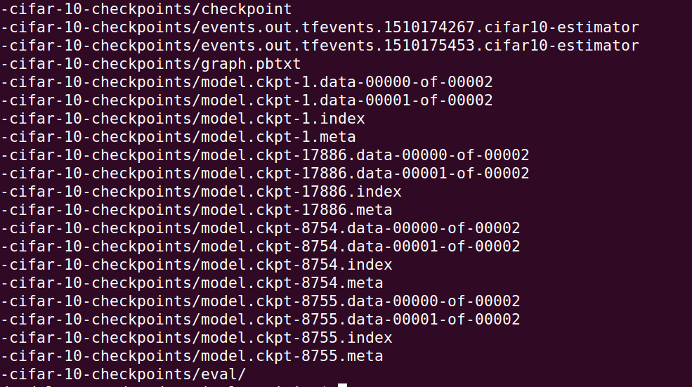
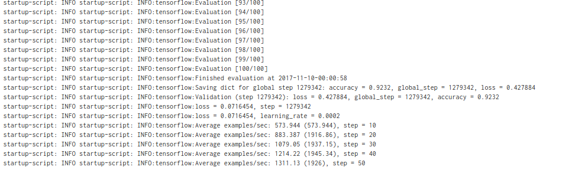

# Compute Engine survival training: TensorFlow Estimator

The nice thing about the [TensorFlow Estimator API](https://www.tensorflow.org/programmers_guide/estimators) is that it provides the same checkpointing semantics as the ones we are using as part of our survival process.

Moreover, the [Cloud ML Engine trainer interface](https://cloud.google.com/ml-engine/docs/packaging-trainer) also accepts model parameters and hyperparameters in the same fashion suggested here. So we should easily be able to take a model intended to run on Cloud ML Engine and run it on a single (but beefy) Compute Engine instance.

Exactly such a model exists! We will make use of the tensorflow/models [CIFAR-10 estimator example](https://github.com/tensorflow/models/tree/master/tutorials/image/cifar10_estimator). The estimator in question wraps a neural network designed to address the image classification task posed by the [CIFAR-10 dataset](https://www.cs.toronto.edu/~kriz/cifar.html) (which consists of 60,000 images distributed uniformly over 10 classes).

Let us follow each of the steps as outlined in [the main README](./README.md) to set this particular model to train on a GPU-enabled Compute Engine instance.


## Custom image

The CIFAR-10 example in question is designed to use multiple GPUs. We will need a Compute Engine instance capable of supporting this. [Let us start out by creating such a Compute Engine instance once and freezing it into a custom image.](./gpu-image.md)

(Note: If you are following along but don't feel like covering the cost of a multi-GPU Compute Engine instance, you can also use one without any GPUs. If you decide to skip the GPUs, ignore all the CUDA and cuDNN instructions below.)


## Trainer CLI

Fortunately, [the CIFAR-10 estimator](https://github.com/tensorflow/models/tree/master/tutorials/image/cifar10_estimator) example [comes wrapped in a CLI whose semantics are very similar to those of our dummy trainer](https://github.com/tensorflow/models/blob/master/tutorials/image/cifar10_estimator/cifar10_main.py). That is the interface we will use for our training job.


### Arguments

The [CIFAR10 estimator training script in tensorflow/models](https://github.com/tensorflow/models/blob/master/tutorials/image/cifar10_estimator/cifar10_main.py) accepts several arguments that we need to specify to kick off the training job. We can specify most of these parameters right now. We will run the following command for training:

```bash
python cifar10_main.py \
    --data-dir <GCS path to data bucket> \
    --job-dir <GCS path to checkpoint bucket> \
    --num-gpus 4 \
    --train-steps 99999999 \
    --momentum 0.9 \
    --weight-decay 0.0002 \
    --learning-rate 0.1 \
    --batch-norm-decay 0.997 \
    --batch-norm-epsilon 0.00001
```

Now we only have to settle the matter of `--data-dir` and `--job-dir`.


### Data

The CIFAR-10 tutorial provides very friendly instructions for the generation of the training, evaluation, and validation datasets (as tfrecords). What we will do is:

1. Download the dataset and generate the `.tfrecords` files locally

1. Push them to a GCS bucket available to our Compute Engine instances

1. At training time, we will pass the GCS path to the data to the `--data-dir` argument

To download the dataset and generate the `.tfrecords`, choose a local path at which you would like to do so, say `/tmp/cifar-10-data`. Then simply navigate to the [CIFAR-10 tutorial](https://github.com/tensorflow/models/tree/master/tutorials/image/cifar10_estimator) folder (you should have `git clone`d [tensorflow/models](https://github.com/tensorflow/models) to your local machine) and run:

```bash
python generate_cifar10_tfrecords.py --data-dir=/tmp/cifar-10-data
```


Now make a bucket in which to store this data (note that bucket names have to be globally unique, so we will prefix this with our project name):

```bash
export GCP_PROJECT=$(gcloud config get-value project)
```

Then

```bash
gsutil mb gs://${GCP_PROJECT}-cifar-10-data
```

Now we can upload our data to the bucket:

```bash
gsutil -m cp -r /tmp/cifar-10-data/*  gs://${GCP_PROJECT}-cifar-10-data/
```

You can test that the data has been transferred using

```bash
gsutil ls gs://${GCP_PROJECT}-cifar-10-data/
```


### Checkpoints

In the course of training, checkpoints will be stored at the path provided to the trainer using the `--job-dir` argument. We can provide a GCS path for this argument, as well, and we will do so.

Let us make ourselves a checkpoint bucket:

```bash
gsutil mb gs://${GCP_PROJECT}-cifar-10-checkpoints
```

With all this preparation in place, we are ready to specify a startup script and define our instance metadata.


## Delivery mechanism

The [tensorflow/models](https://github.com/tensorflow/models) repo exposes each of its subdirectories as Python modules, which is really handy. We are going to simply clone the GitHub repo into our training environment and run the training job from the clone.

Since our image is built off of the Ubuntu 16.04 LTS image, git comes pre-installed, and this literally is as simple as a `git clone` command. You can see this command in the [TensorFlow estimator startup script](./gce/tf-estimator-startup.sh).

## Startup script

We will use the [tf-estimator-startup.sh](./gce/tf-estimator-startup.sh) script, which is only a slight modification of [our dummy original startup script](./gce/startup.sh).


## Instance metadata

We can set instance metadata either by editing our instance in the cloud console or through the `gcloud` CLI. Let us use `gcloud` for this.

First, let us define two environment variables (this assumes that we have already exported the `GCP_PROJECT` environment variable as in the [Data](#Data) section:

```bash
export DATA_DIR=gs://${GCP_PROJECT}-cifar-10-data/ JOB_DIR=gs://${GCP_PROJECT}-cifar-10-checkpoints
```

You should also export your username on the Compute Engine instance (the one under which you created your environment) into the `GCE_USER` environment variable:

```bash
export GCE_USER=<your username on the GCE instance>
```


Assuming you are executing the command from the same directory as this guide:

```bash
./gce/tf-estimator-set-metadata.sh
```

(Note: Remember that we had called our instances `cifar10-estimator`. If you name yours something different, you should make the appropriate modification to the [gce/tf-estimator-set-metadata.sh](./gce/tf-estimator-set-metadata.sh) script.)

You can verify that this metadata has actually been attached to the instance using:

```bash
gcloud compute instances describe cifar10-estimator
```


## Starting your training job

We are now ready to start our training job. And starting it is very simple with the custom metadata and the startup script set on our Compute Engine instance. All we do is:

```bash
gcloud compute instances start cifar10-estimator
```

If you want to see what's going on with the instance, you can use the following command to stream the output to your terminal:

```bash
gcloud compute instances tail-serial-port-output cifar10-estimator --port 1
```

If this times out at first, just try a few more times, as it relies on your instance start up reaching a certain stage.

(Alternatively, you can look at the output from serial port 1 on the page describing your instance in the Cloud Console. But beware, as that output does not auto-refresh.)

If you would like to test that the process actually works, wait for a couple of checkpoints to get stored to your `$JOB_DIR`, which you can monitor with:

```bash
gsutil ls $JOB_DIR
```

Then stop the instance with

```bash
gcloud compute instances stop cifar10-estimator
```

and start it back up again with

```bash
gcloud compute instances start cifar10-estimator
```

You should very quickly see a new checkpoint of value 1 greater than the last one you saw before stopping the instance. That means that TensorFlow has started training the CIFAR-10 estimator from where it left off before your instance shut down.

With the instance corresponding to the image below, I shut down the instance after checkpoint 8754. When it started back up, it checkpointed step 8755 and kept on going from where it left off:




## Training on preemptible instances

It is now possible to spawn preemptible virtual machines with attached GPUs. This, combined with the framework here, allows you to train your models at about half of what it would cost you on on-demand instances.

You have two easy options if you want to use preemptible instances. The first one is to do exactly what we did above, but just create your instance with the as preemptible in Cloud Console or with the  `--preemptible` flag using the `gcloud` command line tool.

The second option involves *continuous* training on preemptible instances. Doing so requires a small extension to the process described above, the reason being that preemptible instances don't exhibit the same auto-restart behaviour that on-demand instances do when they fail or get preempted. To replicate this behaviour, we will make use of Compute Engine's concept of [managed instance groups](https://cloud.google.com/compute/docs/instance-groups/creating-groups-of-managed-instances).

A managed instance group allows you to manage a group of instances as a single entity. In our case our managed instance group is going to be managing a single instance. The utility of the concept stems from the fact, as a part of the management features that they offer, managed instance groups support autoscaling. We will use this functionality to ensure that our instance group is always running a single preemptible instance which, in turn, is running a training job.

Before we can create an instance group, we must create an [instance template](https://cloud.google.com/compute/docs/instance-templates) that the managed instance group will apply. This is equivalent to the step where we created an instance and set its metadata in the on-demand instance training process.

I have included the [tf-estimator-instance-template.sh](./gce/tf-estimator-instance-template.sh) script which will let you create a template for a CIFAR10 estimator training instance. This creates a template named `cifar10-default-params` that uses the default values for the hyperparameters.

Now, spinning up the managed training job is as simple as:

```
gcloud compute instance-groups managed create cifar10-managed --base-instance-name cifar10-managed-instance --size 1 --template cifar10-default-params --zone us-west1-b
```

This will spin up an instance managed by the instance group `cifar10-managed`. The name of this instance will be prefixed by `cifar10-managed` and look like `cifar10-managed-<xxxx>`. Here is my instance, training away happily on CIFAR10 images:




Note how I mentioned your two easy options above, and how the second one was for *continuous* training. The reason for this is that a managed instance group will keep spinning up an instance even if the instance shuts itself down. This means that, once your training job is complete, the instance group manager will keep trying to start it back up again only for it to immediately shut itself down. It takes a little more work on our part to avoid this behaviour, but that will be the subject of a future installment of this work. I hope that the options presented here hold you over until then!


- - -

[HOME](./README.md)
